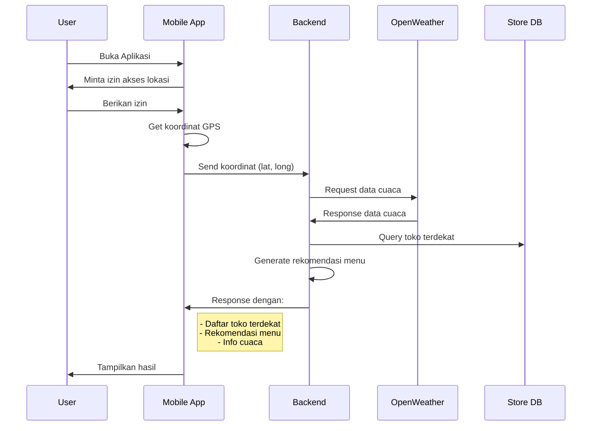

# Swoopix - Backend API

Swoopix adalah aplikasi pemesanan makanan yang dikembangkan sebagai bagian dari mata kuliah Pemrograman Aplikasi Mobile.

## Tim Pengembang (Kelompok 1)

- Vania Cahya (260)
- Nurul Abdillah (449) 
- Maha Aura (166)
- Dy Aluna Dewanti Checylia (302)
- M. Ariiq (154)
- Muhammad Atqiyya (323)

## Dosen Pengampu
Anita Safitri, S.Kom., M.Kom.

## Tentang Aplikasi

Swoopix adalah aplikasi pemesanan makanan yang memungkinkan pengguna untuk:
- Melihat daftar menu dari berbagai toko
- Melakukan pemesanan makanan
- Mendapatkan rekomendasi menu berdasarkan cuaca
- Mencari toko terdekat
- Menggunakan voucher untuk mendapatkan diskon
- Melakukan pembayaran melalui berbagai metode pembayaran

## Fitur Unggulan 🌟

### 1. Rekomendasi Menu Berbasis Cuaca 🌦️
- Integrasi dengan OpenWeather API untuk mendapatkan data cuaca real-time
- Algoritma rekomendasi menu yang disesuaikan dengan kondisi cuaca
- Personalisasi rekomendasi berdasarkan lokasi pengguna
- Contoh: Merekomendasikan makanan hangat saat hujan atau minuman segar saat panas

### 2. Payment Gateway Terintegrasi 💳
- Integrasi dengan Tripay untuk berbagai metode pembayaran
- Mendukung Virtual Account, E-Wallet, QRIS, dll
- Notifikasi status pembayaran real-time
- Sistem pembayaran yang aman dan terpercaya

### 3. Verifikasi OTP via WhatsApp 📱
- Sistem verifikasi pengguna menggunakan OTP
- Integrasi dengan Fontte WhatsApp Gateway
- Pengiriman OTP cepat dan reliable
- Tingkat keamanan yang tinggi dalam proses registrasi

### 4. Integrasi Multi-API 🔄
- OpenWeather API untuk data cuaca
- Tripay API untuk payment gateway
- Fontte API untuk WhatsApp gateway
- Google Maps API untuk fitur lokasi
- Semua API terintegrasi dalam satu sistem yang seamless

### 5. Fitur Lokasi Pintar 📍
- Deteksi lokasi pengguna secara real-time
- Pencarian toko terdekat berdasarkan radius
- Perhitungan jarak dan estimasi waktu pengiriman
- Rekomendasi toko berdasarkan lokasi pengguna

## Teknologi yang Digunakan

- Laravel 10 (Backend Framework)
- MySQL (Database)
- Tripay (Payment Gateway)
- Fontte (WhatsApp Gateway)
- OpenWeather API (Weather Data)

## Fitur Utama

1. Autentikasi
   - Register dengan verifikasi OTP via WhatsApp
   - Login
   - Manajemen profil

2. Manajemen Menu
   - CRUD menu
   - Kategorisasi menu
   - Rekomendasi menu berdasarkan cuaca

3. Manajemen Toko
   - CRUD toko
   - Pencarian toko terdekat
   - Status buka/tutup toko

4. Sistem Pemesanan
   - Pembuatan pesanan
   - Notifikasi WhatsApp untuk toko dan pembeli
   - Manajemen status pesanan

5. Sistem Pembayaran
   - Integrasi dengan Tripay
   - Multiple payment methods
   - Status pembayaran real-time

6. Sistem Voucher
   - Manajemen voucher
   - Validasi penggunaan voucher
   - Perhitungan diskon

## Flow Aplikasi

### 1. Deteksi Lokasi & Rekomendasi Menu



#### Detail Flow:

1. **Permintaan Izin Lokasi**
   - Saat pertama kali membuka app, user diminta izin akses lokasi
   - App menggunakan GPS/Location Service untuk mendapatkan koordinat
   - Koordinat disimpan dan diperbarui secara periodik

2. **Pengiriman Data ke Backend**
   ```json
   POST /api/v1/location
   {
     "latitude": -7.123456,
     "longitude": 112.789012,
     "accuracy": 10.0
   }
   ```

3. **Proses di Backend**
   - Data lokasi diterima
   - Request ke OpenWeather API untuk data cuaca
   - Query database untuk toko dalam radius tertentu
   - Generate rekomendasi berdasarkan:
     * Kondisi cuaca (suhu, kelembaban, curah hujan)
     * Waktu (pagi/siang/malam)
     * Jarak toko ke user

4. **Response ke Mobile App**
   ```json
   {
     "weather": {
       "temp": 30.5,
       "condition": "sunny",
       "humidity": 75
     },
     "nearby_stores": [
       {
         "id": "store-123",
         "name": "Toko A",
         "distance": 0.5,
         "eta": "5 mins"
       }
     ],
     "recommendations": [
       {
         "id": "menu-456",
         "name": "Es Teh",
         "reason": "Cuaca panas, cocok untuk minuman dingin"
       }
     ]
   }
   ```

### 2. Update Lokasi Real-time

1. **Background Location Updates**
   - App melakukan update lokasi setiap:
     * User berpindah lebih dari 100 meter
     * Interval waktu 5 menit
     * User melakukan pull-to-refresh

2. **Geofencing**
   - Notifikasi ketika user memasuki area toko
   - Alert promo/menu spesial toko terdekat
   - Perhitungan ulang rekomendasi menu

3. **Optimisasi Battery & Data**
   - Penggunaan GPS dioptimalkan
   - Caching data lokasi & cuaca
   - Batasan minimum perpindahan untuk update

## Instalasi

1. Clone repository
```bash
git clone https://github.com/yourusername/swoopixbackend.git
cd swoopixbackend
```

2. Install dependencies
```bash
composer install
```

3. Setup environment
```bash
cp .env.example .env
php artisan key:generate
```

4. Konfigurasi database di file .env
```
DB_CONNECTION=mysql
DB_HOST=127.0.0.1
DB_PORT=3306
DB_DATABASE=swoopix
DB_USERNAME=root
DB_PASSWORD=
```

5. Konfigurasi API keys di file .env
```
TRIPAY_API_KEY=your_tripay_api_key
TRIPAY_PRIVATE_KEY=your_tripay_private_key
TRIPAY_MERCHANT_CODE=your_tripay_merchant_code
TRIPAY_SANDBOX=true

FONTTE_API_KEY=your_fontte_api_key

OPENWEATHER_API_KEY=your_openweather_api_key
```

6. Jalankan migrasi database
```bash
php artisan migrate
```

7. Jalankan server
```bash
php artisan serve
```

## API Documentation

Dokumentasi API lengkap dapat dilihat di file [api.md](api.md)

## Lisensi

Hak Cipta © 2024 Kelompok 1 - Pemrograman Aplikasi Mobile
